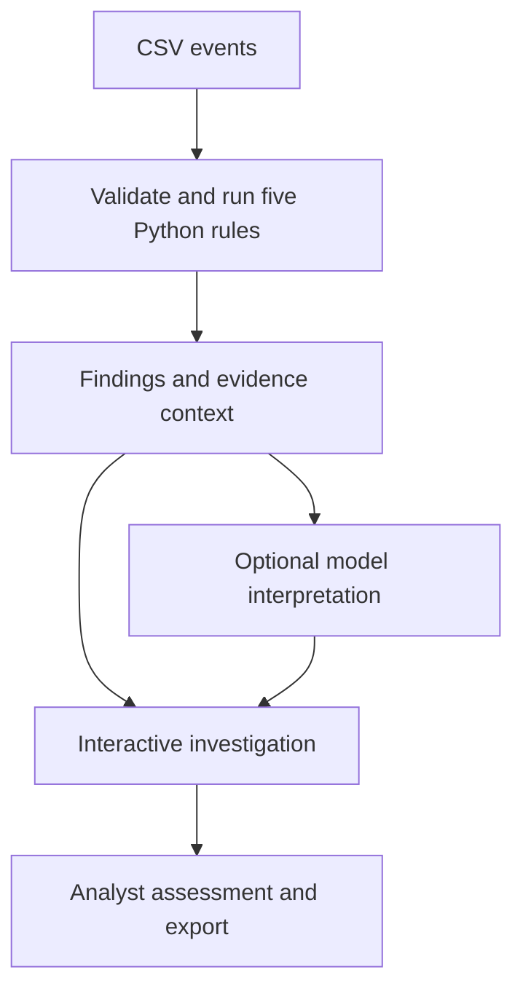

# SILC · Security Intelligence & Log Correlation

A cybersecurity investigation workspace that connects reproducible Python detections to an interactive evidence review. Explore suspicious activity, understand every flag, request an optional model interpretation, and document an analyst decision.

**Open [START_HERE.html](START_HERE.html) for the visual Mac setup guide.**

## Start in one command

Python 3.11, 3.12 or 3.13 is required. In the extracted project folder:

```bash
bash start.sh
```

The first run installs Python dependencies and needs internet access. The browser opens after startup. If it does not, open the address printed in Terminal. The launcher chooses an available local port between 8000 and 8005. Keep Terminal open; **Control+C** stops the app.

You can also type `bash ` (with a space) in any Terminal window, drag `start.sh` from Finder into that window, then press Return. The script finds its own folder.

No npm command, Node installation, API key or paid model is needed to run SILC. Node is optional for the frontend logic tests.

## Explore the workspace

| Area | What it does |
| --- | --- |
| Overview | Analyst/executive views, event timeline, severity chart, detection and protocol breakdowns |
| Alert queue | Search and filter by severity, type, review status, rule support, AI confidence or chart interval |
| Log explorer | Search the entire CSV, filter protocol and linked severity, paginate records and open related findings |
| Analyze logs | Validate an uploaded CSV and create a separate in-memory analysis |
| AI briefing | Offline template or optional Ollama, Gemini, DeepSeek, OpenAI or Claude interpretation |
| Detection rules | Read exact triggers, benign explanations, investigation checks and limitations |
| Project guide | Follow a short demo and understand the code and configuration |

Every case opens with **Reasoning**. Its four tabs are:

- **Reasoning:** observation, rule trigger, confidence labels, earlier-bucket comparison, missing telemetry, false positives and an ATT&CK reference.
- **Evidence:** matching records with stable event IDs; model citations open their source rows.
- **Connections:** observed CSV relationships, nearby events, related findings, and a separately labeled hypothetical follow-on stage.
- **Assessment:** guided checks, analyst status, notes, local activity history and case export.

Chart bars, severity segments, graph nodes and comparison rows show information on hover or keyboard focus. Click supported chart controls to filter findings or open the log explorer. The timeline slider moves through the dataset.

## Reproducible demo

The included sample contains **11,000 synthetic records**, **124 records linked to findings**, and **10 alerts** from five seeded scenarios.

| Finding | Alerts | Matching records |
| --- | ---: | ---: |
| Possible brute force | 1 | 12 |
| Port scan | 1 | 20 |
| Possible SYN flood | 1 | 85 |
| Suspicious DNS query | 6 | 6 |
| Suspicious HTTP redirect | 1 | 1 |
| Total | 10 | 124 |

These are reproducible lab results, not a real-world accuracy measurement.

## Detection, interpretation and decisions



Rules establish repeatable matches. The optional model explains the supplied evidence, suggests alternatives and next checks, and may describe a hypothetical next stage. A strict response schema requires a rationale for every selected finding and rejects unknown event references. It cannot verify the truth of every sentence; the analyst must assess the explanation.

The model cannot change severity, mark cases benign, modify rules or execute response actions.

| Signal | Meaning |
| --- | --- |
| Severity score | Fixed review priority: Critical 95, High 75, Medium 50, Low 25 |
| Detection confidence | “Pattern supported” or “Indicator only”; describes support for the rule match |
| Evidence quality | Partial telemetry; the CSV does not supply every relevant source |
| AI prediction confidence | Low, Moderate, High or Not assessed; the model's uncalibrated self-assessment |
| Dataset comparison | Earlier matching buckets within this CSV, not a verified normal baseline |

None of these labels is a measured attack probability.

## Rules

- **Authentication:** at least 8 failures for a source/destination/username in a fixed 5-minute UTC bucket.
- **Port scan:** at least 12 distinct TCP destination ports for a source/destination in a fixed 5-minute UTC bucket.
- **SYN burst:** at least 60 exact SYN records for a source/destination/port in a fixed 1-minute UTC bucket.
- **DNS:** exact normalized match to a fictional lab indicator on DNS rows.
- **HTTP redirect:** status 300–399 and an exact lab redirect-domain match.

Fixed buckets can miss activity split across boundaries. Indicators use fictional `.example` domains. A rule match does not establish authorization, successful compromise, causality or an outage. ATT&CK links are behavioral references or explicitly labeled hypotheses, not attribution.

## Local data and persistence

SILC is a single-user localhost lab. It has no authentication, live packet capture, production SIEM ingestion, trained ML detector, RAG or automatic containment.

- Uploads: UTF-8 CSV, at most 5 MB, 20,000 rows, 32 columns, 512 characters per field and a 7-day time span.
- Uploaded datasets stay in process memory: at most three, for one hour, until eviction or process restart.
- Saved assessments use browser local storage, keyed by dataset fingerprint and alert ID. They survive refresh in the same browser and local address. A different port, browser, private session or cleared site data has separate storage.
- AI explanations and unsaved drafts last only for the current page session. Export before reloading.
- The queue displays and filters the first 500 findings. Totals cover all findings. Log explorer searches all records.
- A case previews up to 100 matching records, 50 nearby records, 10 related findings and six connections. Its totals disclose those limits.
- The briefing picker displays up to 100 findings with selected cases first; a request can include at most 10.
- Markdown exports include the top 100 backend findings, plus saved assessments and session explanations for displayed or opened findings. Individual JSON case exports include the displayed investigation context and saved review.
- Local activity history records saves using the browser clock. It is not a tamper-proof audit system.
- Keys stay in backend configuration. Cloud calls require server opt-in and per-request confirmation. The full CSV and analyst notes are not sent by the briefing adapter.

## Optional AI

The default **Offline briefing** is a deterministic template. It requires no model.

For local inference, install and open [Ollama](https://ollama.com), then run this in a **second Terminal window**:

```bash
ollama pull gemma3:4b
```

Choose **Ollama (local)** in AI briefing. Start with one finding. The local model uses your computer's memory and processing; no hosted inference account is required.

For cloud providers, follow [AI setup](docs/AI_SETUP.md). You supply the API key and a text model available in your provider account. Model access, quotas and charges depend on that account.

All provider adapters have mocked-response tests. Live model inference still needs to be checked with your chosen provider.

## Code map

| File | Responsibility |
| --- | --- |
| `frontend/index.html` | Navigation and application shell |
| `frontend/styles.css` | Color system, components, responsive layouts |
| `frontend/app.js` | Shared UI state, API requests, uploads and report export |
| `frontend/workspace.js` | Interactive charts, logs, Reasoning, citations and saved assessments |
| `src/validation.py` | CSV validation and normalization |
| `src/detections.py` | Deterministic detections and complete matching-event indexes |
| `src/intelligence.py` | Explanations, comparisons, correlation, case IDs and report context |
| `src/config.py`, `src/rules.py` | Thresholds, lab indicators and readable rule descriptions |
| `src/api.py` | Same-origin API and in-memory upload lifecycle |
| `src/ai_providers.py` | Provider adapters, structured response validation and offline briefing |
| `scripts/launch.py` | Local startup and browser opening |
| `scripts/generate_events.py` | Reproducible synthetic dataset |
| `tests/` | Detection, API, model-contract and frontend logic checks |

## Verification

After the first startup creates the environment:

```bash
.venv/bin/python -m pytest -q
```

Optional frontend checks, if Node is installed:

```bash
node tests/frontend_logic.cjs
```

See [validation status](docs/VALIDATION.md) for actual results and the remaining manual browser checks.

For CLI analysis, run `.venv/bin/python -m src.analyze`. To regenerate the sample, run `.venv/bin/python scripts/generate_events.py`. Restart SILC after changing the sample or rule settings because the built-in analysis is cached.

## Demonstrate it and publish your repository

1. Follow the [three-minute recruiter walkthrough](docs/INTERVIEW_GUIDE.md).
2. Save an assessment in your own words and export a case.
3. Make a small frontend or detection change and record the result in [your project journal](docs/MY_CONTRIBUTIONS.md).
4. Create a GitHub repository named `silc-security-workspace`.
5. Upload the extracted source, tests, documentation and synthetic sample. The repository should show these files directly, rather than contain only a ZIP.
6. Keep private keys, local environments, real logs and sensitive exports out of the repository.
7. Add screenshots from your running app, a short demo recording and the repository link to your resume.

## Documentation

- [Visual setup guide](START_HERE.html)
- [Feature checklist](docs/FEATURE_CHECKLIST.md)
- [Recruiter walkthrough](docs/INTERVIEW_GUIDE.md)
- [API contract](docs/FRONTEND_API.md)
- [AI setup](docs/AI_SETUP.md)
- [Design and customization](docs/THEME_GUIDE.md)
- [Validation and manual checks](docs/VALIDATION.md)
- [Project journal](docs/MY_CONTRIBUTIONS.md)
- [Synthetic example report](docs/EXAMPLE_REPORT.md)
